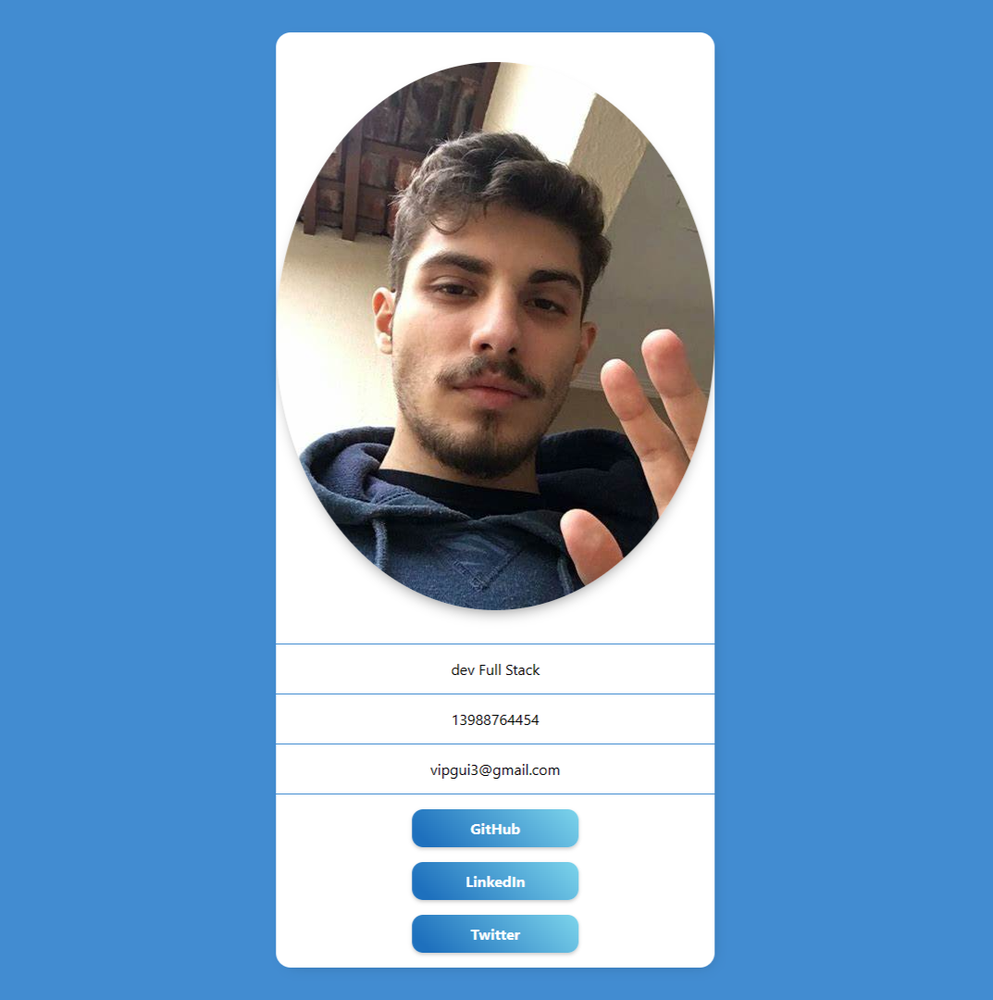

# Projeto do Cartão Pessoal em React.js
Este é um projeto em React.js que consiste em um pequeno "cartão" pessoal que exibe informações de contato, como email, links para GitHub, LinkedIn e Twitter. O objetivo deste projeto é aplicar e praticar conceitos fundamentais do React.js, como componentes e props.

# Funcionalidades
O projeto apresenta as seguintes funcionalidades:

Exibe um cartão personalizado com seu nome,foto, email e informações de contato.
Inclui links para o seu perfil no GitHub e LinkedIn.
Permite que os usuários entrem em contato com você diretamente através do email fornecido.

